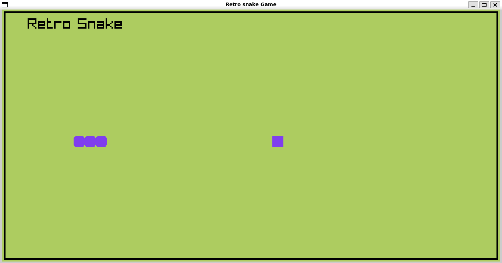

# gridSnakeCPP

A fun snake game with loved ones :)

## Motivation

This game was created with motivation that I will be going home for the holidays and since I have younger brothers, I thought it will be cool to have something to kill time by. It is not a complex game but it will kill boredom and increase my programming skill in C++.

## Future Plans

I plan to make the game more fun and visually appealing in the future hoping I can achieve making it available online

## Technology Used

## `The game is fully built in C++`

## Screenshot

#### Game Screenshot in terminal

## Contribution

If you want to improve or just help me in any way please don't be afraid I am not RUST programming language :) (I fear that language). You can contribute by suggesting new ideas, reporting bugs, or even helping me to make the game available online.

## References

you can find how to make this cool game here: [YouTube](https://www.youtube.com/watch?v=LGqsnM_WEK4)
oh and the game was created using a cool game engine called raylib and you can find it here: [raylib](https://github.com/raysan5/raylib)
